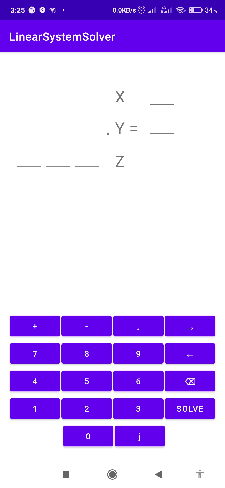
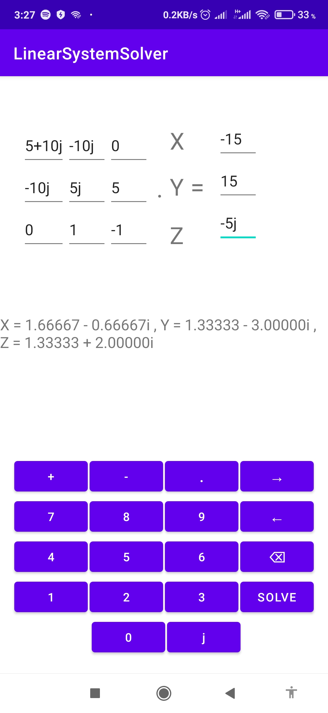

# LinearSystemSolver 
is a simple android app for solving linear system of equations .
the app has the ability to solve systems where the coefficients of the variables are complex and real numbers .

the app's main layout

solving system of complex coefficients

